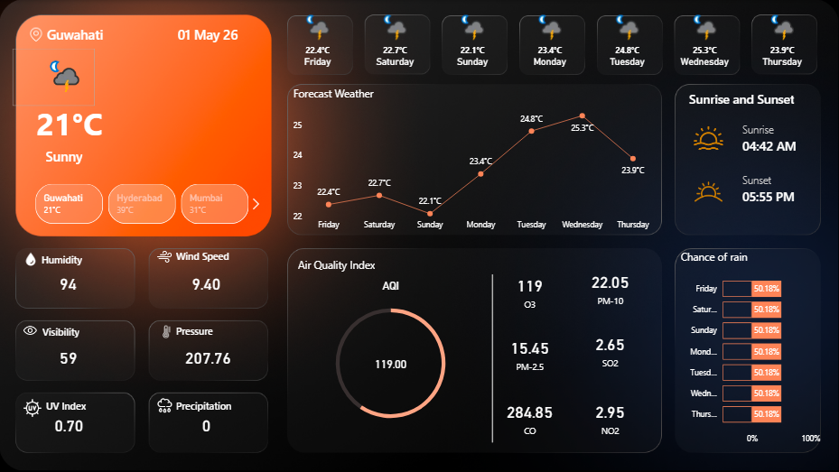

# 🌍 Multi-City Real-Time Weather & Air Quality Dashboard

A high-performance, interactive Power BI dashboard featuring a modern **Glassmorphism** design. This project tracks live weather patterns and **National Air Quality Index (AQI)** metrics across multiple Indian cities, including **Noida, Hyderabad, Mumbai, Guwahati**, and regions across **Maharashtra** and **Uttar Pradesh**.

---

## 🚀 Project Overview

This dashboard transforms raw JSON data from live APIs into a professional-grade visual story. It provides real-time environmental insights, focusing on atmospheric conditions and public health safety levels.

### ✨ Key Features
*   **Live Multi-City Tracking**: Dynamic switching between cities like Hyderabad, Noida, Mumbai, and Guwahati.
*   **API-Driven Data**: Real-time integration with Weather and Air Quality APIs.
*   **IND-AQI Logic**: Custom DAX implementation of the **Central Pollution Control Board (CPCB)** standards.
*   **Pollutant Breakdown**: Detailed monitoring of PM2.5, PM10, O3, NO2, SO2, and CO.
*   **Modern UI/UX**: Dark-themed glassmorphism interface with custom-designed KPI cards and charts.

---

## 🛠️ Technical Stack
*   **Tool**: Power BI Desktop
*   **Language**: DAX (Data Analysis Expressions)
*   **Data Source**: OpenWeatherMap API / Air Quality API
*   **Design**: Glassmorphism / Dark Mode

---

## 📊 DAX Implementation: India AQI Formula

The project calculates individual sub-indices for each pollutant using linear interpolation and returns the maximum value as the overall AQI:

```dax
India_Overall_AQI = 
VAR SubIndices = { 
    [SubIndex_PM2.5], 
    [SubIndex_PM10], 
    [SubIndex_O3], 
    [SubIndex_NO2], 
    [SubIndex_SO2] 
}
RETURN
MAXX(SubIndices, [Value])
```

---

## 🖼️ Dashboard Preview



*(Note: Upload your screenshot to your GitHub repository and name it `dashboard_screenshot.png` for it to appear here.)*

---

## 🙏 Credits & Inspiration
This project was developed by following the tutorials on **The Developer** YouTube channel. Their guidance on Power BI design and API integration was instrumental in achieving this professional look.

---

## 📂 How to Set Up
1. **Clone the repository**:
   ```bash
   git clone https://github.com
   ```
2. **API Key**: Obtain a free API key from OpenWeatherMap.
3. **Power Query**: Open the `.pbix` file, click on **Transform Data**, and replace the placeholder API key with your own.
4. **Refresh**: Click **Refresh** to pull live data for your selected cities.

---

## 🤝 Connect
If you found this project useful, please give it a ⭐!
*   **LinkedIn**: (https://www.linkedin.com/in/manish-jaiswar-13615b377/)
*   **YouTube Inspiration**: [The Developer]([https://youtube.com](https://www.youtube.com/watch?v=P8HB8dMfKNc&t=2374s))
